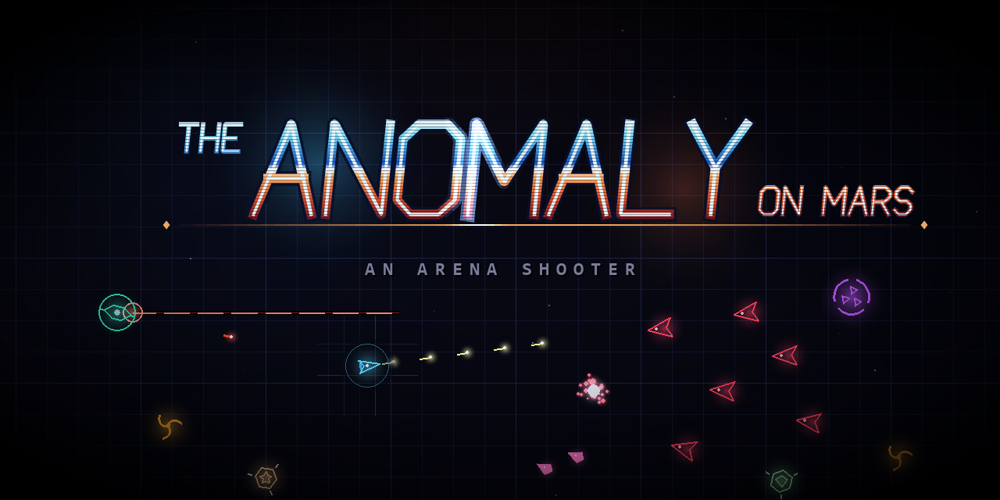
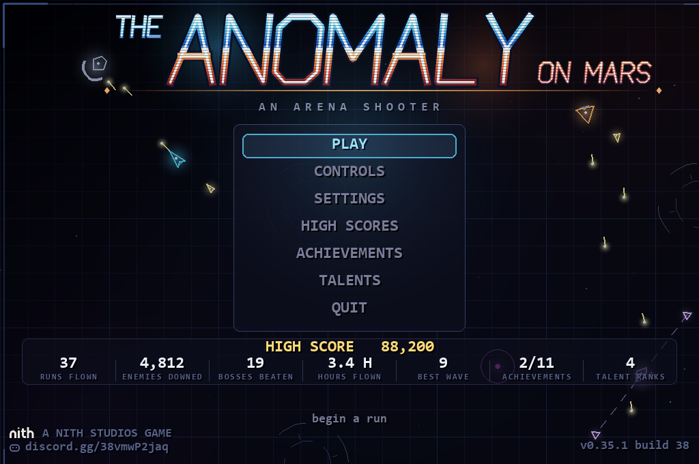
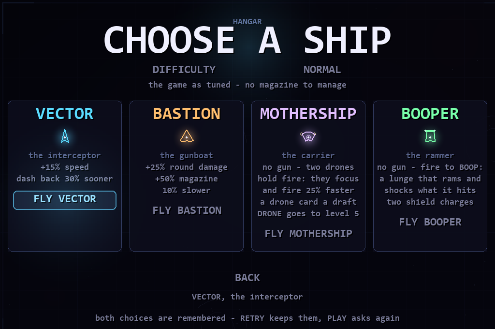
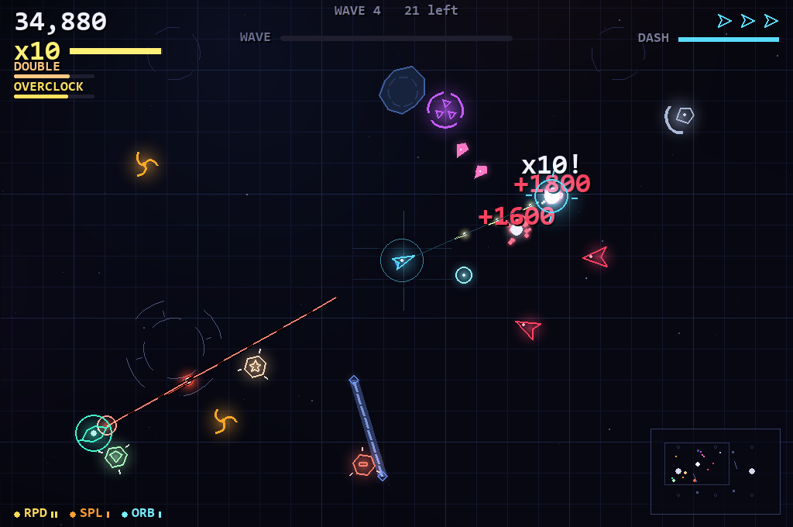
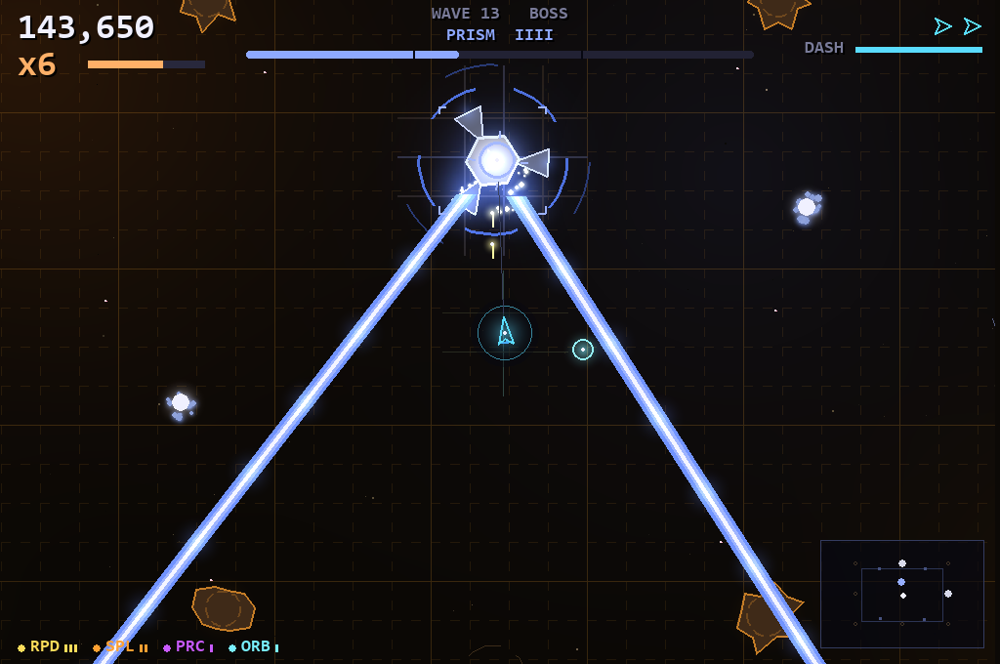
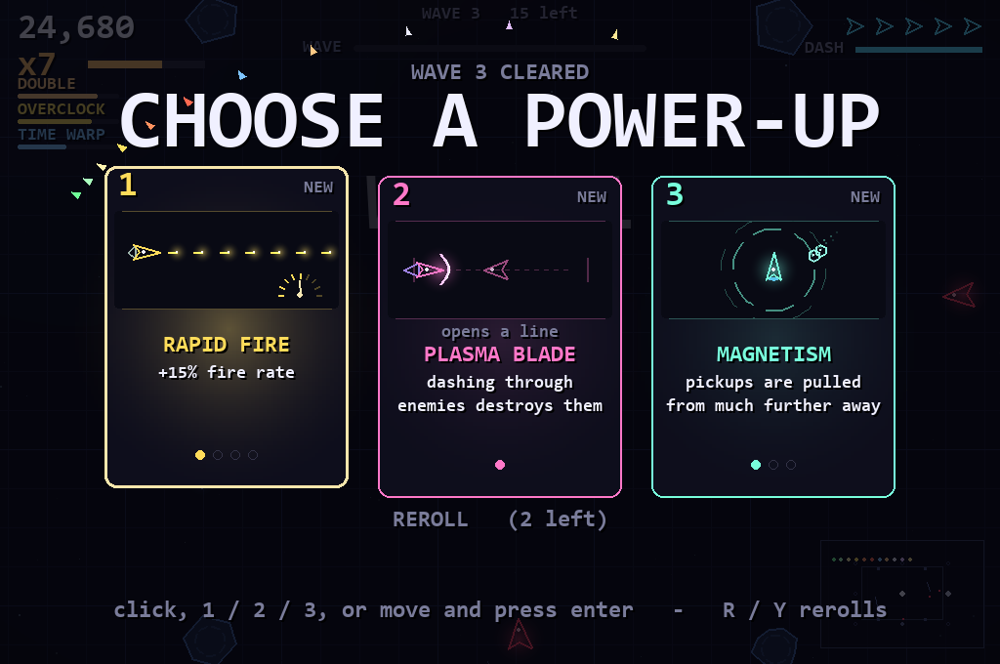
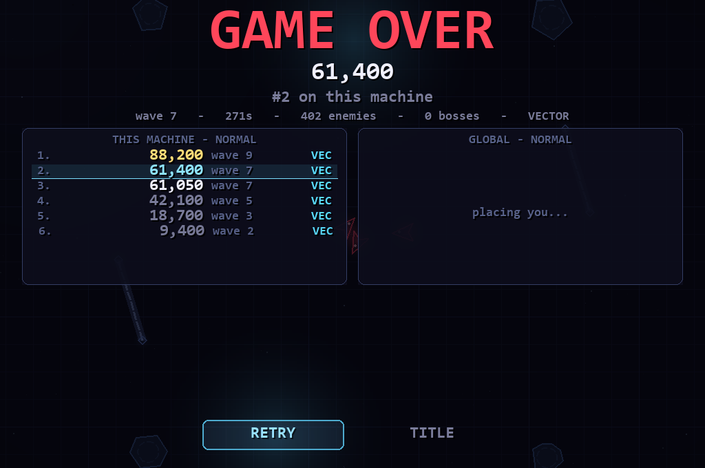

  

  <b>THE ANOMALY ON MARS</b> - a native neon arena shooter for Windows, set on Mars. 
  One executable, no installer, no asset files: every shape, glow, particle and note is generated at runtime.

  <a href="https://github.com/BuildAppolis/anomaly-in-mars-releases/releases/latest"><b>Download the latest build</b></a>
  &nbsp;&middot;&nbsp; <a href="https://discord.gg/38vmwP2jaq">Discord</a>

   
  A NITH STUDIOS GAME

---

## Download

Grab `TheAnomalyOnMars-<version>.exe` from the
[latest release](https://github.com/BuildAppolis/anomaly-in-mars-releases/releases/latest)
and double-click it. Python, pygame and numpy are all inside the file; nothing
needs installing. Windows shows a blue "Windows protected your PC" screen the
first time because the exe is not code-signed: **More info -> Run anyway**.

Once installed the game calls itself `TheAnomalyOnMars.exe` and keeps that
name through every update, so a shortcut to it keeps working. It checks this
page on its title screen; when a newer build exists an **UPDATE** row appears
under PLAY, downloads the build beside the running one, verifies it against the
SHA-256 in `latest.json`, and restarts into it.

Each release carries the build and `latest.json`, the manifest the game reads.
This repository holds binaries and this page only; the source lives elsewhere.

## What it is

A twin-stick arena shooter in a neon vector style: a ship, a dash, a gun (or a
wing of drones, or a bumper bar), and waves of enemies that end in a boss every
fifth wave. Every wave ends in a draft of three cards that stack into a build.
Four ships, three difficulties, a talent tree earned across runs, achievements,
and two leaderboards: one on your machine and a global one every copy of the
game can read and add to.

- **Fourteen enemy kinds** from chasers to the TURRET, the LASHER and the
  DRILLER, each with a tell before it hurts you. From wave six they carry
  affixes that stack as the run goes on.
- **Five floors**, each its own room of asteroids and walls, with comets that
  cross the whole arena behind a warning lane.
- **Forty-five cards**, thirteen of them lines that open once another card is
  held; six that only the BOOPER is dealt.
- **Five bosses** with phases, in packs of two from wave ten.
- **Keyboard and mouse or any gamepad**, every menu working from both.

<table>
  <tr>
    <td></td>
    <td></td>
  </tr>
  <tr>
    <td></td>
    <td></td>
  </tr>
  <tr>
    <td></td>
    <td></td>
  </tr>
</table>

## Controls

| Action | Keyboard and mouse | Gamepad |
| --- | --- | --- |
| Move (with drift) | W A S D or arrow keys | left stick |
| Aim | mouse | right stick |
| Fire, focus, BOOP | left mouse or space | right stick, RT, A or RB |
| Dash (short invulnerability) | right mouse or shift | LT, B or LB |
| Reload early | R | X |
| Pause | Esc or P | Start |

## Community

Bugs, scores, ideas: [discord.gg/38vmwP2jaq](https://discord.gg/38vmwP2jaq).

THE ANOMALY ON MARS is a NITH STUDIOS game.

